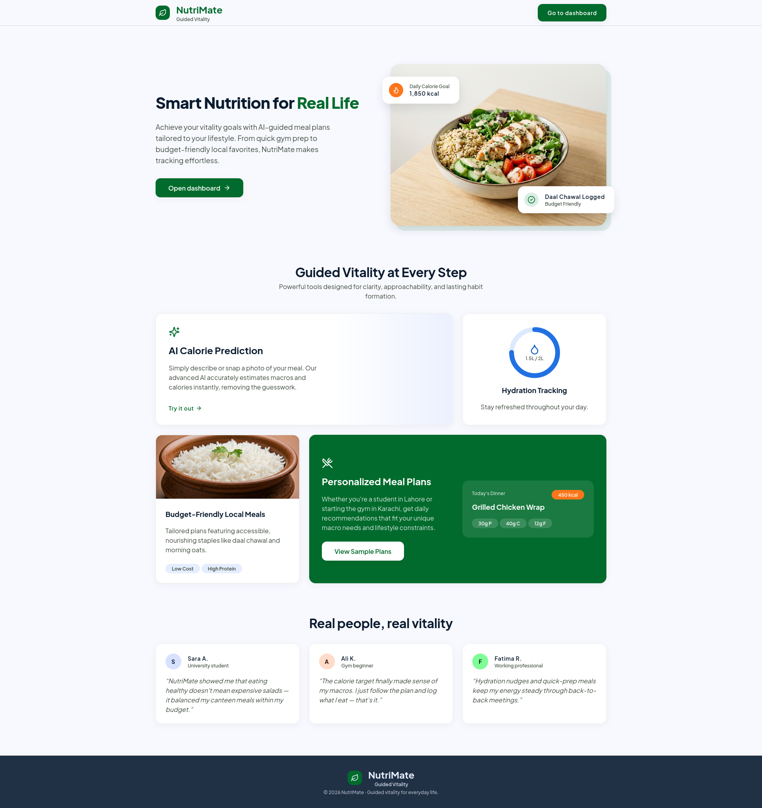
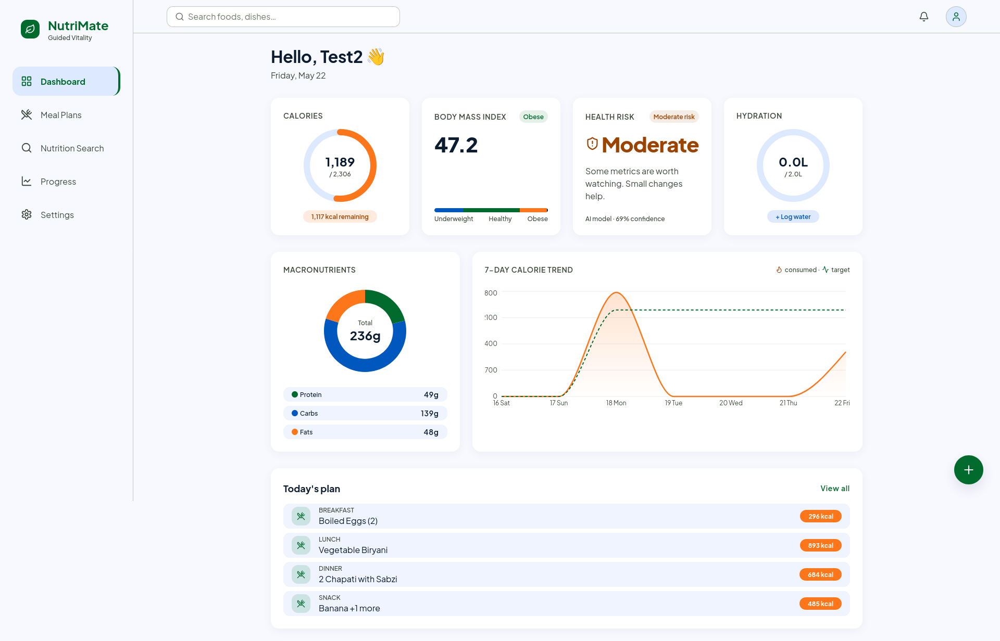
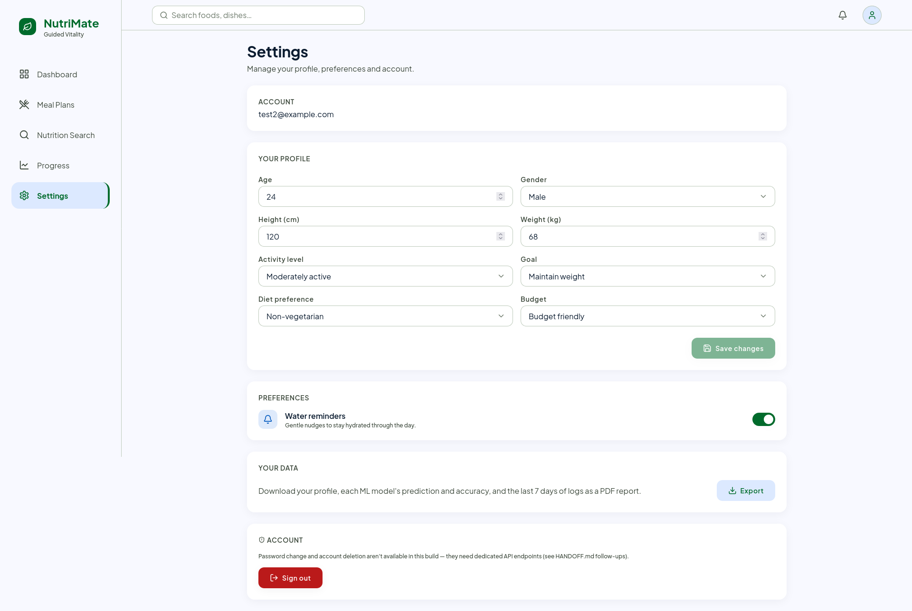
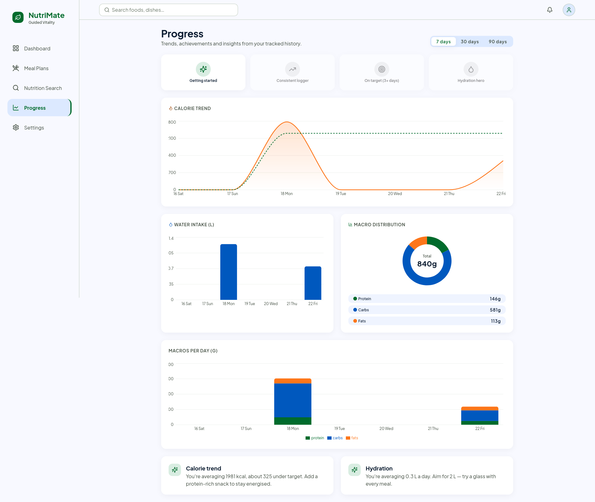
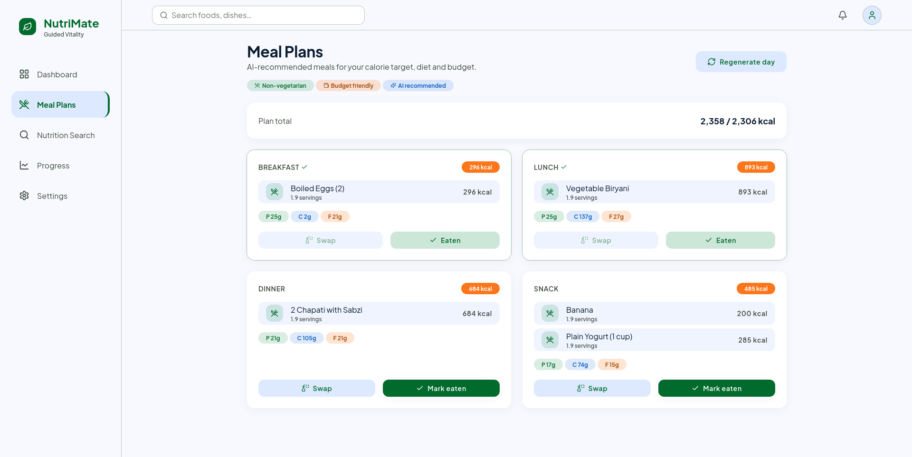
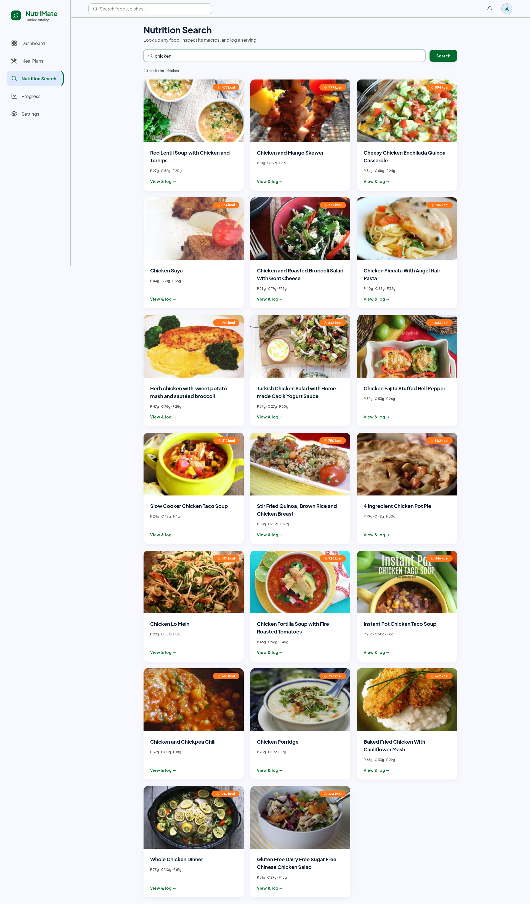
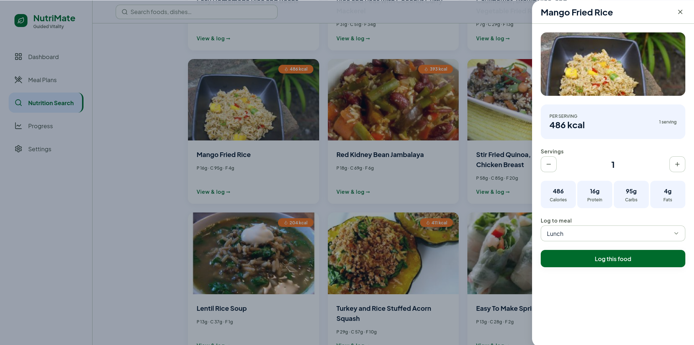

# NutriMate

> AI-powered diet and meal recommendation platform with calorie targets, meal planning, hydration guidance, and health-risk insights for students, gym beginners, and budget-conscious users.

NutriMate combines a React + Vite frontend, an Express API gateway, and a FastAPI machine-learning service into one monorepo. The system uses three models behind the scenes: an ANN for daily calorie prediction, a KNN meal recommender, and an SVM health-risk classifier. When the ML service is unavailable, the product falls back to deterministic rules so the core experience still works.

See [PRD.md](./PRD.md), [TRD.md](./TRD.md), and [IMPLEMENTATION_PLAN.md](./IMPLEMENTATION_PLAN.md) for the full product and technical background.

## Screenshots

<table>
	<tr>
		<td align="center" width="50%">
			
			<br><strong>Landing page</strong>
		</td>
		<td align="center" width="50%">
			
			<br><strong>Dashboard</strong>
		</td>
	</tr>
	<tr>
		<td align="center" width="50%">
			
			<br><strong>Profile settings</strong>
		</td>
		<td align="center" width="50%">
			
			<br><strong>Progress analytics</strong>
		</td>
	</tr>
	<tr>
		<td align="center" width="50%">
			
			<br><strong>Meal plans</strong>
		</td>
		<td align="center" width="50%">
			
			<br><strong>Nutrition search</strong>
		</td>
	</tr>
	<tr>
		<td align="center" width="50%">
			
			<br><strong>Log meal</strong>
		</td>
		<td align="center" width="50%">
			
			<br><strong>Settings</strong>
		</td>
	</tr>
</table>

## What’s inside

- Personalized calorie targets powered by a prediction model with graceful fallback logic.
- Meal recommendations built around profile, goal, dietary preference, and budget.
- Health-risk classification with clear output for the user and API consumers.
- A responsive frontend with a guided onboarding flow, dashboard, meal logging, and analytics.
- Shared TypeScript schemas so the web app, API, and ML service stay aligned.

## Monorepo Layout

```
nutrimate/
├── apps/
│   ├── web/                # React + Vite SPA
│   └── api/                # Express API gateway
├── services/
│   └── ml/                 # FastAPI ML service
├── packages/
│   └── shared-types/       # Shared TS types and schemas
├── screenshots/            # Product screenshots used in this README
├── PRD.md                  # Product requirements
├── TRD.md                  # Technical requirements
└── IMPLEMENTATION_PLAN.md  # Phased delivery plan
```

## Tech Stack

| Layer       | Technology                                                   |
| ----------- | ------------------------------------------------------------ |
| Frontend    | React, Vite, TypeScript, Tailwind CSS, React Query, Recharts |
| API         | Node.js, Express, MongoDB, JWT, Zod, Pino                    |
| ML service  | Python, FastAPI, TensorFlow, scikit-learn                    |
| Shared code | Workspace packages and shared TypeScript schemas             |

## Requirements

| Tool    | Version     | Notes                                        |
| ------- | ----------- | -------------------------------------------- |
| Node.js | 20 or newer | The repo is tested with modern Node releases |
| pnpm    | 9.x         | Managed through Corepack                     |
| Python  | 3.11.x      | Required for the ML service and TensorFlow   |
| MongoDB | 7.x         | Local database for the API                   |

Verify your environment:

```bash
node --version
pnpm --version
python3 --version
mongosh --version
```

## Quick Start

1. Install dependencies with `pnpm install`.
2. Copy `.env.example` to `.env` and add your secrets and connection strings.
3. Build the shared package with `pnpm --filter @nutrimate/shared-types build`.
4. Start MongoDB locally.
5. Set up the ML service virtual environment in `services/ml` and install its Python dependencies.

Example setup commands:

```bash
pnpm install
cp .env.example .env
pnpm --filter @nutrimate/shared-types build
```

### ML service setup

```bash
cd services/ml
python3.11 -m venv .venv
source .venv/bin/activate
pip install -e ".[dev]"
```

Train the models from the ML service directory:

```bash
python pipelines/preprocess.py
python pipelines/train_ann.py
python pipelines/train_knn.py
python pipelines/preprocess_obesity.py
python pipelines/train_svm.py
```

See [services/ml/README.md](./services/ml/README.md) for dataset placement and model details.

## Run Locally

Start the full stack in separate terminals:

```bash
# MongoDB
mongod --dbpath ~/data/db

# ML service on :8000
cd services/ml && source .venv/bin/activate
uvicorn nutrimate_ml.main:app --host 0.0.0.0 --port 8000

# API on :4000
pnpm --filter @nutrimate/api seed:catalog
pnpm --filter @nutrimate/api dev

# Web app on :5173
pnpm --filter @nutrimate/web dev
```

Open the web app at http://localhost:5173. The experience degrades gracefully if the ML service is offline, using deterministic fallback logic for calories, meal planning, and health-risk guidance.

## Workspace Scripts

| Command             | What it does                            |
| ------------------- | --------------------------------------- |
| `pnpm install`      | Install all workspace dependencies      |
| `pnpm build`        | Build every package in the monorepo     |
| `pnpm typecheck`    | Run TypeScript checks across workspaces |
| `pnpm lint`         | Run ESLint across the repo              |
| `pnpm format`       | Format supported files with Prettier    |
| `pnpm format:check` | Check formatting in CI-friendly mode    |

Per-package commands:

```bash
pnpm --filter @nutrimate/api dev
pnpm --filter @nutrimate/api seed:catalog
pnpm --filter @nutrimate/web dev
pnpm --filter @nutrimate/web build
```

## Environment Variables

All runtime variables live in the repo-root `.env` file. Common ones include:

| Variable                                   | Used by | Notes                                         |
| ------------------------------------------ | ------- | --------------------------------------------- |
| `MONGODB_URI`                              | api     | MongoDB connection string                     |
| `JWT_ACCESS_SECRET` / `JWT_REFRESH_SECRET` | api     | Each must be at least 32 characters           |
| `ML_SERVICE_URL`                           | api     | ML service base URL, default `:8000`          |
| `SPOONACULAR_API_KEY`                      | api     | Optional recipe and nutrition search provider |
| `EDAMAM_APP_ID` / `EDAMAM_APP_KEY`         | api     | Optional fallback provider                    |
| `ML_KNN_K`                                 | ml      | KNN neighbour count, default `8`              |
| `VITE_API_BASE_URL`                        | web     | API base URL for the SPA                      |

If external nutrition APIs are not configured, search falls back to the local food catalog.

## Related Docs

- [PRD.md](./PRD.md)
- [TRD.md](./TRD.md)
- [IMPLEMENTATION_PLAN.md](./IMPLEMENTATION_PLAN.md)
- [services/ml/README.md](./services/ml/README.md)

## License

Released under the [MIT License](./LICENSE).
